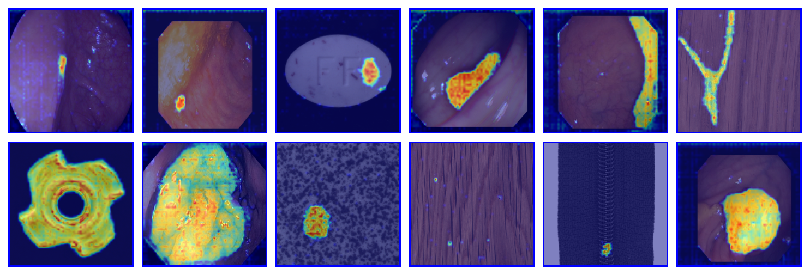

# AdaSAM-AD

This repository is the official implementation of AdaSAM-AD: Boosting SAM2 for Fine-grained Pixel-level Anomaly Detection via Spatial-Channel Calibration and Deformable Cascades

## Visualization
<div align="center">
  <!-- SAVE FIGURE 1 or 6 FROM THE PDF AS assets/visuals.png -->
  
  <br>
  <em>Qualitative results of AdaSAM-AD on diverse anomaly detection tasks. Our framework demonstrates superior pixel-level localization across various industrial and medical scenarios, accurately capturing irregular morphologies with fine-grained boundaries.</em>
</div>


## 🔧 Requirements

python==3.11.10

Please install the following dependencies:

```
- torch==2.5.1+cu121
- torchvision==0.20.1+cu121
- einops==0.8.1
- opencv-python==4.13.0.90
- numpy==2.3.4
- pillow==10.2.0
- matplotlib==3.10.8
```


SAM-2 Installation
```
1.Clone and install SAM-2 manually from https://github.com/facebookresearch/sam2
2.cd sam2
3.pip install -e .
```

## Training

To train the model(s) in the paper, please modify the relevant hyperparameters run in [train.py](train.py) this command:

```
python train.py
```

## Evaluation

To evaluate the model(s) in the paper, please modify the relevant hyperparameters in [test.py](test.py) and run this command:

```
python test.py
```

